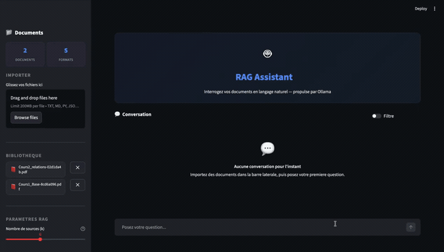

# RAG-IA : Chatbot Intelligent avec Retrieval-Augmented Generation

[](https://www.python.org/downloads/)
[](https://langchain.com/)
[](https://ollama.ai/)
[](https://streamlit.io/)
[](LICENSE)

Un chatbot RAG (Retrieval-Augmented Generation) qui permet de poser des questions sur vos documents PDF, TXT, Markdown et plus encore. Utilise des LLM locaux via Ollama pour une confidentialite totale de vos donnees.

---

## Demo



> [](https://www.youtube.com/watch?v=_9JMfpYkW9w)

---

## Fonctionnalites

- **Chat intelligent** sur vos documents avec reponses en langage naturel
- **Multi-format** : PDF, TXT, Markdown, Python, JSON
- **LLM local** via Ollama (aucune donnee envoyee sur internet)
- **Recherche intelligente** avec filtres automatiques via LLM
- **Gestion des documents** : ajout, suppression, detection des doublons
- **Interface web** moderne avec Streamlit
- **Interface CLI** pour les developpeurs
- **Compatible** macOS, Linux et Windows

---

## Demarrage rapide

### Option 1 : Lancement automatique (recommande)

**macOS / Linux :**
```bash
./start.sh
```

**Windows :**
```batch
start.bat
```

Le script va automatiquement :
1. Verifier/installer les dependances
2. Demarrer Ollama si disponible
3. Telecharger le modele LLM si necessaire
4. Ouvrir l'application dans votre navigateur

### Option 2 : Lancement manuel

```bash
# Installer les dependances
poetry install

# Lancer l'application
poetry run streamlit run src/front/app.py
```

---

## Prerequis

| Outil | Version | Obligatoire | Installation |
|-------|---------|-------------|--------------|
| Python | 3.12+ | Oui | [python.org](https://www.python.org/downloads/) |
| Poetry | 1.7+ | Oui | `pip install poetry` |
| Ollama | Latest | Oui | [ollama.ai](https://ollama.ai/) |

### Installation d'Ollama

**macOS :**
```bash
brew install ollama
```

**Linux :**
```bash
curl -fsSL https://ollama.ai/install.sh | sh
```

**Windows :**
```bash
winget install --id=Ollama.Ollama -e
```

### Telecharger un modele LLM

```bash
# Modele recommande (leger et performant)
ollama pull llama3.2:3b

# Autres modeles disponibles
ollama pull mistral:7b-instruct
ollama pull llama3.2:1b
ollama pull deepseek-r1:8b
```

---

## Structure du projet

```
RAG_ia/
├── src/
│   ├── front/                 # Interface utilisateur
│   │   ├── app.py             # Application Streamlit
│   │   ├── module_app.py      # Logique metier
│   │   └── cli.py             # Interface ligne de commande
│   │
│   ├── rag/                   # Coeur du systeme RAG
│   │   ├── rag.py             # Pipeline RAG principal
│   │   ├── embedding.py       # Chunking et embeddings
│   │   ├── chroma_database.py # Base vectorielle ChromaDB
│   │   ├── vectoriel_research.py  # Recherche semantique
│   │   ├── load_fichier.py    # Chargement des documents
│   │   ├── prompt.py          # Templates de prompts
│   │   └── nettoyer_data.py   # Nettoyage des textes
│   │
│   ├── modele/                # Modeles IA
│   │   ├── modele_LLM_ollama.py   # Integration Ollama
│   │   └── modele_Embeddings.py   # Modeles d'embeddings
│   │
│   └── gestionnaire_fichier.py    # Utilitaires fichiers
│
├── data/
│   ├── data_rag/              # Vos documents sources
│   ├── chroma_db/             # Base vectorielle
│   └── all_chunks/            # Export des chunks
│
├── test/                      # Scripts de test
├── start.sh                   # Lanceur macOS/Linux
├── start.bat                  # Lanceur Windows
├── pyproject.toml             # Dependances Poetry
└── README.md
```

---

## Utilisation

### Interface Web (Streamlit)

1. **Lancez l'application** avec `./start.sh` ou `start.bat`
2. **Uploadez vos documents** via la sidebar
3. **Posez vos questions** dans le chat
4. **Activez le filtre LLM** pour des recherches plus precises

### Interface CLI

```bash
# Lancer le CLI
poetry run python -m src.front.cli

# Tester le RAG
poetry run python test/test_rag.py
```

### Modes de recherche

| Mode | Description | Utilisation |
|------|-------------|-------------|
| **Default** | Recherche par similarite (top-5) | Questions generales |
| **Filtre** | Filtrage intelligent via LLM | Questions avec criteres (date, source, etc.) |

---

## Architecture RAG

```
┌─────────────────────────────────────────────────────────────────┐
│                        PIPELINE RAG                              │
├─────────────────────────────────────────────────────────────────┤
│                                                                  │
│  Documents ──► Chunking ──► Embeddings ──► ChromaDB             │
│  (PDF, TXT)    (800 car)    (MiniLM)       (Vectoriel)          │
│                                                                  │
│  Question ──► Retriever ──► Context ──► LLM ──► Reponse         │
│              (Top-K ou      (Chunks     (Ollama)                │
│               Self-Query)    pertinents)                        │
│                                                                  │
└─────────────────────────────────────────────────────────────────┘
```

### Composants

| Composant | Technologie | Role |
|-----------|-------------|------|
| **Embeddings** | sentence-transformers/all-MiniLM-L6-v2 | Vectorisation du texte |
| **Vector Store** | ChromaDB | Stockage et recherche vectorielle |
| **LLM** | Ollama (llama3.2, mistral) | Generation de reponses |
| **Framework** | LangChain | Orchestration du pipeline |
| **UI** | Streamlit | Interface web |

---

## Configuration

### Modeles disponibles

```python
# Modeles LLM (via Ollama)
model_ollama = [
    "llama3.2:3b",        # Recommande - equilibre vitesse/qualite
    "llama3.2:1b",        # Plus rapide, moins precis
    "mistral:7b-instruct", # Plus precis, plus lent
    "deepseek-r1:8b"      # Raisonnement avance
]

# Modeles d'embeddings
modele_embedding = [
    "sentence-transformers/all-MiniLM-L6-v2",           # Anglais (rapide)
    "sentence-transformers/paraphrase-multilingual-MiniLM-L12-v2"  # Multilingue
]
```

### Parametres de chunking

```python
chunk_size = 800      # Taille des chunks (caracteres)
chunk_overlap = 120   # Chevauchement entre chunks
```

---

## Formats de fichiers supportes

| Extension | Type | Status |
|-----------|------|--------|
| `.pdf` | PDF | Actif |
| `.txt` | Texte | Actif |
| `.md` | Markdown | Actif |
| `.py` | Python | Actif |
| `.json` | JSON | Actif |
| `.docx` | Word | Disponible |
| `.xlsx` | Excel | Disponible |
| `.html` | HTML | Disponible |
| `.csv` | CSV | Disponible |

---

## Scripts de test

```bash
# Tester le pipeline RAG complet
poetry run python test/test_rag.py

# Tester la connexion Ollama
poetry run python test/test_llm_ollama.py

# Verifier l'utilisation GPU
poetry run python test/utilisation_GPU.py

# Exporter tous les chunks
poetry run python test/ecriture_all_chunks_Chromadb.py
```

---

## Developpement

### Installation pour developpeurs

```bash
# Cloner le repo
git clone https://github.com/AlexisGauthron/RAG_ia.git
cd RAG_ia

# Installer les dependances
poetry install

# Avec support CUDA (Linux/Windows uniquement)
poetry install --extras cuda
```

### Lancer les tests

```bash
poetry run python -m pytest test/
```

---

## Troubleshooting

### Ollama ne demarre pas

```bash
# Verifier le statut
ollama serve

# Redemarrer le service
pkill ollama && ollama serve
```

### Erreur de memoire

Utilisez un modele plus leger :
```bash
ollama pull llama3.2:1b
```

### Probleme d'encodage PDF

Assurez-vous que le PDF contient du texte (pas uniquement des images scannees).

---

## Contribution

Les contributions sont les bienvenues !

1. Fork le projet
2. Creez une branche (`git checkout -b feature/amelioration`)
3. Committez vos changements (`git commit -m 'Ajout de fonctionnalite'`)
4. Push la branche (`git push origin feature/amelioration`)
5. Ouvrez une Pull Request

---

## License

Ce projet est sous licence MIT - voir le fichier [LICENSE](LICENSE) pour plus de details.

---

## Auteur

**Alexis Gauthron** - [@AlexisGauthron](https://github.com/AlexisGauthron)

---

<p align="center">
  <i>Fait avec LangChain, Ollama et Streamlit</i>
</p>
