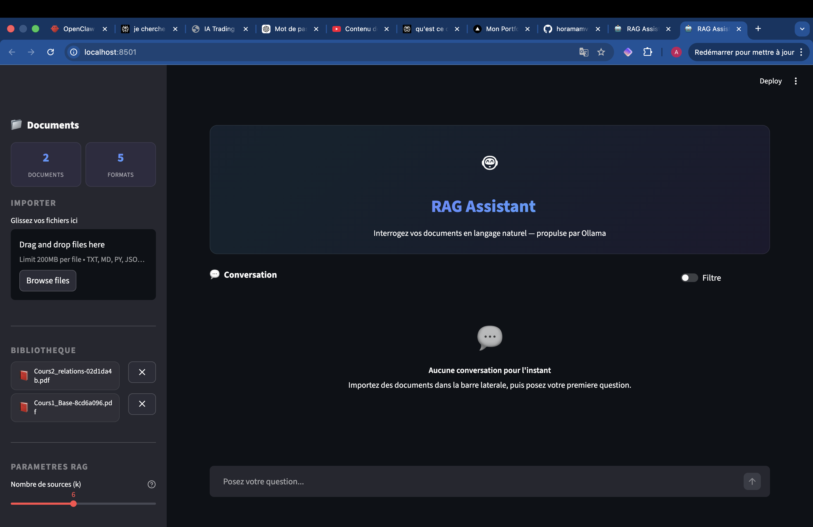
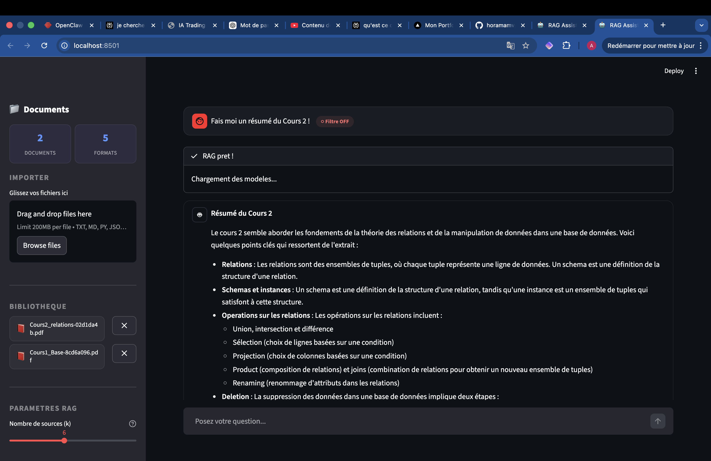
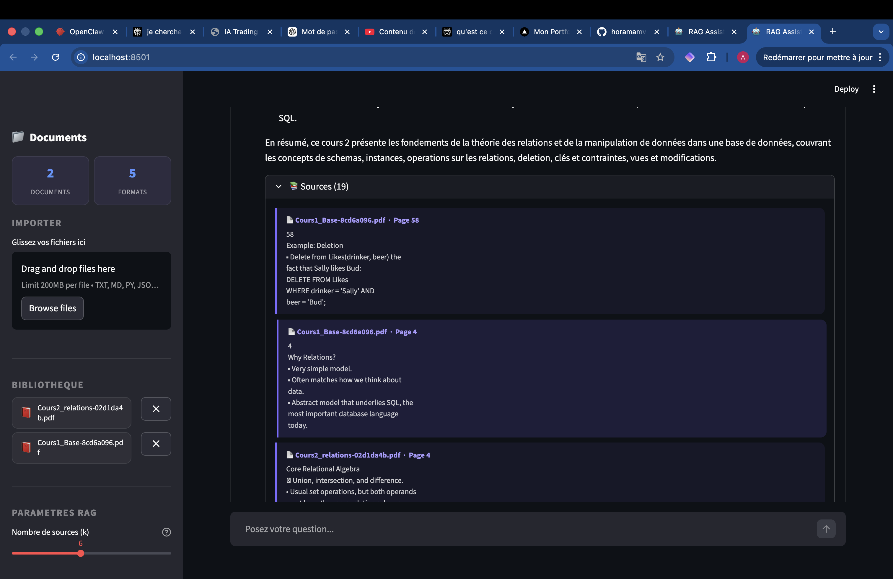

## Apercu


## Description

RAG-IA est un assistant conversationnel qui permet d'interroger ses documents en langage naturel. Le systeme repose sur une architecture Retrieval-Augmented Generation (RAG) : les documents uploades sont decoupes en chunks, vectorises via SentenceTransformers, puis indexes dans une base ChromaDB. A chaque question, le moteur de recherche semantique recupere les passages les plus pertinents et les injecte comme contexte dans un LLM local (Ollama) pour generer une reponse sourcee.

L'originalite du projet reside dans son systeme dual de recherche. Le mode par defaut utilise MMR (Maximal Marginal Relevance) couple a un MultiQueryRetriever qui reformule automatiquement la question en 3 variantes pour maximiser la couverture. Le mode filtre exploite un SelfQueryRetriever qui analyse la question via un second LLM pour generer dynamiquement des filtres sur les metadonnees (source, page, auteur, date). Un mecanisme de fallback bascule automatiquement vers MMR si le filtre echoue.

L'ensemble tourne entierement en local, sans appel a des APIs cloud, garantissant la confidentialite des donnees. L'interface Streamlit offre un chat fluide avec affichage des sources, gestion des documents par drag-and-drop, et controle en temps reel des parametres de recherche.

## Screenshots

### Interface principale

*Interface Streamlit avec sidebar de gestion des documents, upload drag-and-drop et parametres de recherche.*

### Chat en mode Filtre

*Reponse structuree en mode Filtre ON : le SelfQueryRetriever cible automatiquement le bon document via les metadonnees.*

### Affichage des sources

*Section Sources depliee montrant les extraits de documents utilises pour generer la reponse, avec metadonnees (fichier, page).*

## Fonctionnalites principales

- Recherche semantique dual-mode : MMR classique avec expansion de requete (MultiQueryRetriever) ou filtrage intelligent par metadonnees via SelfQueryRetriever avec fallback automatique
- Upload et traitement multi-formats : PDF, TXT, Markdown, Python, JSON avec chunking adaptatif (800 caracteres, 120 overlap) et nettoyage automatique du texte
- Synchronisation ChromaDB/disque : detection et suppression des orphelins, normalisation des chemins, reconstruction automatique de la base si corrompue
- Interface conversationnelle avec historique, affichage des sources par document et page, toggle filtre en temps reel et slider pour le nombre de sources (k=3-10)
- Deduplication automatique des documents et enrichissement des metadonnees (auteur, dates, nombre de pages)
- 4 LLMs configurables via Ollama (llama3.2, mistral, deepseek-r1) avec parametres avances (temperature, top_p, mirostat)

## Stack technique

| Categorie | Technologies |
|-----------|-------------|
| Framework LLM | LangChain, LangChain Community |
| LLMs locaux | Ollama (llama3.2:3b, mistral:7b-instruct, deepseek-r1:8b) |
| Base vectorielle | ChromaDB |
| Embeddings | SentenceTransformers (paraphrase-multilingual-MiniLM-L12-v2) |
| Deep Learning | PyTorch, Transformers (HuggingFace) |
| Parsing documents | PyPDF, Unstructured |
| Interface | Streamlit |
| Langage | Python 3.13 |

## Architecture

```
Utilisateur
    |
    v
[Streamlit UI] ── toggle ── [Mode Default] / [Mode Filtre]
    |                              |                |
    v                              v                v
[Upload/Delete]            [MMR + MultiQuery]  [SelfQuery LLM]
    |                              |                |
    v                              |           [Fallback MMR]
[Chunking 800c]                    |                |
    |                              v                v
    v                        [EmbeddingsFilter]
[SentenceTransformers]             |
    |                              v
    v                     [RetrievalQA Chain]
[ChromaDB]                         |
    ^                              v
    |                     [Ollama LLM local]
    |                              |
[sync_files()]                     v
                             [Reponse + Sources]
```

## Defis et apprentissages

- Le SelfQueryRetriever genere des filtres dont le format depend du LLM utilise (guillemets simples vs doubles, structure JSON variable). La mise en place d'un parser robuste avec regex flexible et fuzzy matching sur les noms de fichiers a permis de fiabiliser le filtrage quel que soit le modele.
- La gestion de coherence entre ChromaDB et le systeme de fichiers a necessite un mecanisme de synchronisation bidirectionnelle au demarrage, capable de detecter les orphelins des deux cotes et de reconstruire la base automatiquement en cas de corruption.
- L'EmbeddingsFilter rejetait systematiquement les resultats pour des requetes vagues (ex: "Parle moi du cours 2") car la similarite cosinus entre la requete et le contenu etait trop faible. L'ajustement du seuil selon le mode de recherche (strict en mode default, permissif en mode filtre ou les metadonnees ciblent deja le bon document) a resolu le probleme.
- L'integration de multiples LLMs avec des roles distincts (generation a temperature basse pour la precision, retriever a temperature haute pour la diversite des filtres) a demande une comprehension fine des parametres d'inference et de leur impact sur la qualite des reponses.
